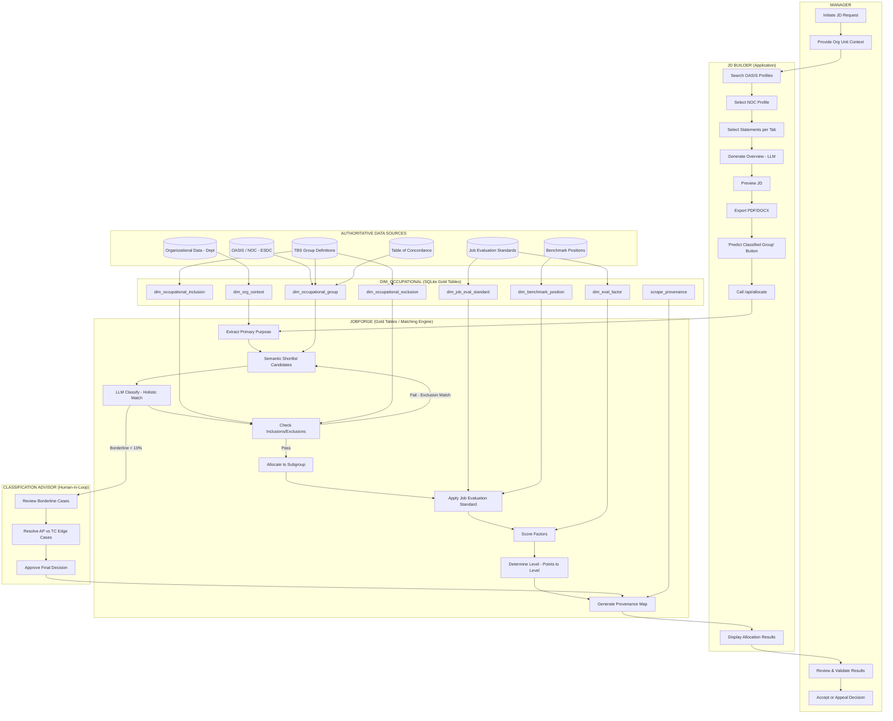

# TBS Job Classification - BPMN Swimlane Diagram

**Document Type:** BPMN 2.0 Compliant Process Map
**Created:** 2026-02-04
**Purpose:** Visual representation of end-to-end job classification automation

---

## Mermaid Swimlane Diagram



---

## Swimlane Actors

| Lane | Actor | Role | Automation Status |
|------|-------|------|-------------------|
| **Manager** | Hiring Manager | Initiates request, provides context, validates results | Manual input required |
| **JD Builder** | JD Builder Lite Application | User interface for JD creation | ✓ Automated (v2.0) |
| **JobForge** | Matching Engine + Gold Tables | Classification logic and reference data | Partial (v4.0 = Steps 1-4) |
| **Classification Advisor** | HR Classification Specialist | Edge case resolution, final approval | Human-in-loop |
| **Data Sources** | External Authoritative Systems | TBS, ESDC, Departmental data | Scraped/imported |
| **Gold Tables** | DIM_OCCUPATIONAL Database | Normalized reference data with provenance | ✓ Automated (v4.0) |

---

## Process Steps by Lane

### Manager Lane

| Step | Activity | Input | Output | Automation |
|------|----------|-------|--------|------------|
| M1 | Initiate JD Request | Business need | Request created | Manual |
| M2 | Provide Org Unit Context | Organizational knowledge | Context data | Manual (v5.1 can pre-populate) |
| M3 | Review & Validate Results | Classification recommendation | Validation decision | Manual |
| M4 | Accept or Appeal Decision | Review outcome | Final decision | Manual |

### JD Builder Lane

| Step | Activity | Input | Output | Automation |
|------|----------|-------|--------|------------|
| JD1 | Search OASIS Profiles | Search query | Profile list | ✓ Automated |
| JD2 | Select NOC Profile | Profile selection | Selected profile | ✓ Automated |
| JD3 | Select Statements | Statement checkboxes | Selected statements | ✓ Automated |
| JD4 | Generate Overview | Selected statements | LLM overview | ✓ Automated |
| JD5 | Preview JD | All selections | JD preview | ✓ Automated |
| JD6 | Export PDF/DOCX | JD data | Exported document | ✓ Automated |
| JD7 | "Predict Classified Group" | Button click | API call trigger | v4.0 Phase 17 |
| JD8 | Call /api/allocate | JD data | API request | ✓ v4.0 API ready |
| JD9 | Display Allocation Results | API response | UI display | v4.0 Phase 17 |

### JobForge Lane

| Step | Activity | Input | Output | Automation |
|------|----------|-------|--------|------------|
| JF1 | Extract Primary Purpose | JD text | Purpose summary | ✓ v4.0 |
| JF2 | Semantic Shortlist | Purpose + definitions | Candidate groups | ✓ v4.0 |
| JF3 | LLM Classify | Candidates + JD | Ranked recommendations | ✓ v4.0 |
| JF4 | Check Inclusions/Exclusions | Recommendations | Verified/rejected | ✓ v4.0 |
| JF5 | Allocate to Subgroup | Verified group | Full allocation code | ✓ v4.0 |
| JF6 | Apply Job Evaluation Standard | Allocation + JD | Factor inputs | v5.0 |
| JF7 | Score Factors | Factor inputs | Point scores | v5.0 |
| JF8 | Determine Level | Total points | Classification level | v5.0 |
| JF9 | Generate Provenance Map | All decisions | Audit trail | ✓ v4.0 |

### Classification Advisor Lane

| Step | Activity | Input | Output | Automation |
|------|----------|-------|--------|------------|
| CA1 | Review Borderline Cases | Flagged recommendations | Review decision | Human-in-loop |
| CA2 | Resolve AP vs TC Edge Cases | Edge case details | Resolution | Human-in-loop |
| CA3 | Approve Final Decision | Review outcome | Ratified decision | Human-in-loop |

### Data Sources Lane

| Source | Type | Data Provided | Refresh Frequency |
|--------|------|---------------|-------------------|
| OASIS / NOC | ESDC Web | NOC profiles, tasks, skills, work context | Daily (live scrape) |
| TBS Group Definitions | TBS Web | 29 group definitions, inclusions, exclusions | Monthly |
| Job Evaluation Standards | TBS Web/PDF | Factor definitions, degree levels, points | Annually |
| Table of Concordance | TBS Web | Group ↔ Standard mapping, subgroups | Annually |
| Benchmark Positions | TBS Database | Pre-scored reference positions | As published |
| Organizational Data | Department | Org context, mandates, supervisor relationships | Real-time |

### Gold Tables Lane

| Table | Source | Records | Purpose |
|-------|--------|---------|---------|
| dim_occupational_group | TBS scrape | ~29 groups | Group definitions |
| dim_occupational_inclusion | TBS scrape | ~200 statements | Inclusion examples |
| dim_occupational_exclusion | TBS scrape | ~150 statements | Exclusion examples |
| dim_job_eval_standard | TBS (v5.0) | 18 standards | Evaluation standards |
| dim_eval_factor | TBS (v5.0) | ~150 factors | Factor definitions |
| dim_benchmark_position | TBS (v5.0) | TBD | Reference positions |
| dim_org_context | Dept (v5.1) | TBD | Organizational context |
| scrape_provenance | System | Per scrape | Data lineage |

---

## Gateway Decisions

| Gateway | Condition | True Path | False Path |
|---------|-----------|-----------|------------|
| Exclusion Check | Primary purpose matches exclusion? | Return to Shortlist (JF2) | Proceed to Subgroup (JF5) |
| Borderline Flag | Top 2 scores within 10%? | Route to Classification Advisor (CA1) | Proceed to Provenance (JF9) |
| Manager Acceptance | Manager accepts recommendation? | Complete | Appeal/Revise |

---

## Data Flow Summary

```
┌─────────────────────────────────────────────────────────────────────────────────┐
│                              DATA FLOW DIRECTION                                 │
├─────────────────────────────────────────────────────────────────────────────────┤
│                                                                                  │
│   EXTERNAL SOURCES          GOLD TABLES              PROCESSING            UI   │
│   ════════════════          ═══════════              ══════════            ══   │
│                                                                                  │
│   ┌──────────┐                                                                   │
│   │  OASIS   │────────┐                                                          │
│   └──────────┘        │                                                          │
│                       ▼                                                          │
│   ┌──────────┐    ┌──────────┐    ┌──────────┐    ┌──────────┐    ┌──────────┐  │
│   │   TBS    │───▶│   DIM_   │───▶│ JobForge │───▶│   API    │───▶│    JD    │  │
│   │  Defs    │    │OCCUPATION│    │  Engine  │    │ Response │    │ Builder  │  │
│   └──────────┘    │   AL     │    └──────────┘    └──────────┘    └──────────┘  │
│                   └──────────┘         │                               │         │
│   ┌──────────┐         ▲               │                               │         │
│   │   Org    │─────────┘               ▼                               ▼         │
│   │   Data   │                   ┌──────────┐                    ┌──────────┐    │
│   └──────────┘                   │ Classif. │                    │  Manager │    │
│                                  │ Advisor  │                    │          │    │
│                                  └──────────┘                    └──────────┘    │
│                                                                                  │
└─────────────────────────────────────────────────────────────────────────────────┘
```

---

## BPMN Notation Reference

| Symbol | Meaning | Usage |
|--------|---------|-------|
| Rectangle | Activity/Task | Process step |
| Diamond | Gateway | Decision point |
| Circle (thin) | Start Event | Process begins |
| Circle (thick) | End Event | Process completes |
| Solid Arrow | Sequence Flow | Process order within lane |
| Dashed Arrow | Message Flow | Communication between lanes |
| Pool | Participant | Organization or system |
| Lane | Actor | Role within participant |
| Data Store | Database | Persistent storage |

---

*Diagram created: 2026-02-04*
*BPMN Version: 2.0 compliant notation*
*Rendering: Mermaid.js compatible*
